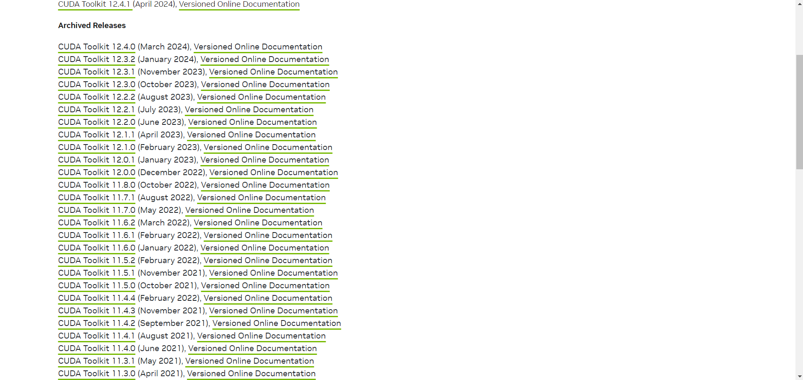

# IMAGE-SUPER-RESOLUTION-SYSTEM

#### This project involves the fundamentals of a super-resolution artificial intelligence that enhances an image to higher quality and resolution, and includes a working example with a basic model.

## Prerequisites:
1: Python 3.8 or later  
2: Compatible with Windows, MacOS, Linux  
3: midrange to powerful computer

## Installation Instructions:

### If you have an RTX graphics card, you can use the CUDA system to significantly speed up artificial intelligence training. Instructions for setting up the CUDA system:

1: Please go to the website https://pytorch.org/, scroll down a bit, and retrieve the download command for a PyTorch version compatible with CUDA as per your requirements. Then, execute it in your Python environment's console.

2: Go to the link https://developer.nvidia.com/cuda-toolkit-archive, find and download the CUDA version you selected when downloading the PyTorch library, and install it.

3: If you have completed all the steps correctly, run the Trainmodel code. If everything is as it should be, after the code runs, it should print "Device: cuda". If it prints "Device: cpu", it means something has gone wrong. In this case, manually delete the torch and torchvision libraries and rerun the code you get from this link: https://pytorch.org/.

### If you do not have an RTX graphics card, you can install the libraries in the usual way:
1 pip:  
pip install torch torchvision

2 conda:  
conda install pytorch torchvision -c pytorch

## Included Codes:
### Video2Frame_Data_Generator.py:
This code randomly selects a specified total number of frames from videos in the video_datas folder, then creates two different images with those frames at two different qualities: low quality at 720p and high quality at 1080p. It saves these images in the 720p_frames and 1080p_frames folders for the purpose of training artificial intelligence.

### TrainModel.py:
This code collects high and low-quality photos from the folders named 720p_frames and 1080p_frames, and uses them to train a super-resolution artificial intelligence model on the torch library to enhance the quality of images. It then saves this model and tests it on a photograph.

### inference_code:
This code loads a trained and saved model, and attempts to enhance the quality and resolution of a given photograph using this model, then saves the enhanced photograph.
